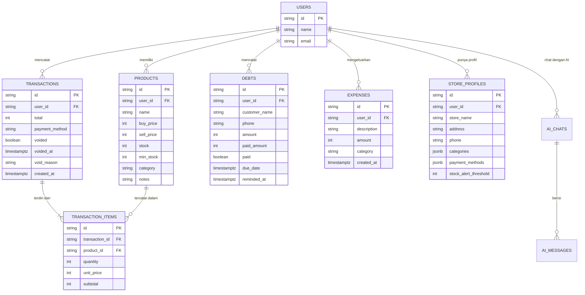

# PRD — WarungKu OS

## 1. Overview
**WarungKu OS** adalah aplikasi web yang dirancang khusus untuk membantu pemilik UMKM di Indonesia (warung makan, toko kelontong, usaha rumahan) mengelola operasional harian mereka.

Banyak UMKM yang masih mengalami "kebutaan finansial" — uang pribadi dan usaha tercampur, menebak-nebak jumlah stok barang, dan tidak memiliki catatan keuangan yang rapi. WarungKu OS hadir untuk menyelesaikan masalah tersebut dalam satu aplikasi yang mudah digunakan: pencatatan penjualan, pembukuan dasar, manajemen stok, pencatatan hutang pelanggan (kasbon), hingga asisten AI.

## 2. Status
**Production-ready.** Semua fitur MVP telah diimplementasi dan deploy ke Vercel dengan database PostgreSQL cloud (Neon).

## 3. Requirements
- **Platform:** Aplikasi Web (PWA), dioptimalkan untuk tampilan tablet-first (kasir warung).
- **Konektivitas:** Online — membutuhkan koneksi internet untuk API calls.
- **Database:** PostgreSQL (Neon cloud) — bukan SQLite.
- **Model Bisnis:** Freemium / Basic Free.
- **Adopsi:** Transaksi harus bisa diselesaikan di bawah 5 detik dengan sentuhan jari.
- **Integrasi:** WhatsApp (langsung ke `api.whatsapp.com/send` tanpa provider ketiga).

## 4. Core Features

### 4.1 Tap-to-Sell POS (Kasir Cepat)
- Layar kasir visual dengan grid ikon produk.
- Tap produk untuk tambah ke keranjang, adjust jumlah, atau hapus item.
- Pilihan metode bayar: Tunai (Cash), QRIS, atau Transfer Bank.
- Stok otomatis terpotong setiap transaksi sukses.
- Struk cetak via `window.print()` dengan print CSS.

### 4.2 Buku Hutang (Kasbon Pelanggan)
- Catat pelanggan yang berhutang: nama, nomor WhatsApp, nominal, jatuh tempo.
- Bayar parsial (sebagian) atau lunas penuh.
- Tandai sebagai lunas.
- Kirim pengingat tagihan via WhatsApp — langsung ke `api.whatsapp.com/send` (support mobile & desktop).
- Statistik: total kasbon aktif, jumlah pelanggan lunas, jumlah pengingat terkirim.
- Filter: Semua, Belum lunas, Lunas.
- Search by nama atau nomor WA.

### 4.3 Inventaris & Stok
- Kelola produk: nama, harga beli, harga jual, stok saat ini, stok minimum, kategori, catatan.
- Restok produk (tambah stok).
- Kategori produk (JSONB) — pengelolaan fleksibel.
- Notifikasi stok menipis di dashboard.

### 4.4 Laporan Keuangan & PDF
- Laporan laba/rugi (income vs expense) dengan grafik (Recharts).
- Filter periode: Harian, Mingguan, Bulanan.
- Detail transaksi per periode.
- Cetak PDF via `window.print()` — data terlihat di print preview.

### 4.5 Pengeluaran
- CRUD pengeluaran: tambah, edit, hapus.
- Filter pengeluaran per periode (Semua, Harian, Mingguan, Bulanan).
- Terintegrasi ke laporan keuangan.

### 4.6 Void Transaksi
- Batalkan transaksi yang sudah tercatat.
- Stok otomatis dikembalikan.
- Transaksi ditandai sebagai "Dibatalkan" di riwayat.

### 4.7 AI Assistant
- Asisten virtual kontekstual berbasis LLM via OpenRouter API.
- Dapat menjawab pertanyaan tentang data bisnis (stok, penjualan, hutang).
- Sidebar kanan yang collapsible, bisa dipanggil dari halaman mana pun.
- Riwayat chat tersimpan per sesi.

### 4.8 Pengaturan Warung
- Edit profil warung: nama, alamat, nomor WA pemilik.
- Kelola metode pembayaran.
- Atur ambang batas notifikasi stok menipis.
- Reset workspace.

### 4.9 PWA (Progressive Web App)
- Installable di HP/tablet sebagai aplikasi native.
- Service worker untuk offline caching.
- Manifest dengan icon dan theme color.

## 5. User Flow
1. **Daftar & Login** — Pengguna mendaftar/login via Better Auth.
2. **Pengaturan** — Isi profil warung, daftar produk, atur stok minimum.
3. **Transaksi** — Pelanggan datang → tap produk → pilih metode bayar → selesai (< 5 detik).
4. **Kasbon** — Catat pelanggan berhutang → kirim pengingat WA saat jatuh tempo → tandai lunas saat bayar.
5. **Laporan** — Cek keuntungan harian/mingguan/bulanan → cetak PDF untuk pengajuan KUR.
6. **AI Assistant** — Tanya "Berapa stok minyak goreng?" atau "Siapa yang masih berhutang?".

## 6. Architecture

```
┌──────────────────────────────┐
│   Pengguna (Tablet/HP/Browser)│
│          ↓                    │
│   Next.js Frontend (React 19) │
│   Tailwind + shadcn/ui        │
│          ↓                    │
│   Next.js API Routes          │
│   (App Router)                │
│          ↓          ↓         │
│   PostgreSQL     WhatsApp API  │
│   (Neon Cloud)   (Direct URL) │
│          ↓                    │
│   OpenRouter API               │
│   (AI Assistant)               │
└──────────────────────────────┘
```

- **Monolitik** — Frontend dan backend dalam satu Next.js app.
- **No external API provider** — WhatsApp langsung via `api.whatsapp.com/send` (anchor element).
- **Cloud database** — Neon PostgreSQL, bukan SQLite.
- **Serverless deployment** — Vercel, auto-deploy dari GitHub.

## 7. Database Schema

**Tabel utama:**

| Tabel | Deskripsi |
|---|---|
| `users` | Pemilik warung (via Better Auth) |
| `session` | Auth session |
| `accounts` | Auth accounts |
| `verification` | Auth verification |
| `store_profiles` | Profil warung (nama, alamat, no WA, metode bayar, ambang stok) |
| `products` | Produk dagangan |
| `transactions` | Transaksi penjualan (termasuk void status) |
| `transaction_items` | Detail item per transaksi |
| `debts` | Kasbon pelanggan (termasuk bayar parsial) |
| `expenses` | Pengeluaran warung |
| `ai_chats` | Sesi chat AI |
| `ai_messages` | Pesan dalam chat AI |
| `schema_migrations` | Versi migrasi database |



## 8. Tech Stack

| Layer | Teknologi |
|---|---|
| Framework | Next.js 16 (App Router) |
| Language | TypeScript |
| UI Library | React 19 |
| Styling | Tailwind CSS v4 + shadcn/ui |
| Database | PostgreSQL (Neon cloud) |
| ORM | Drizzle ORM |
| Auth | Better Auth |
| Validation | Zod |
| Chart | Recharts |
| AI | OpenRouter API |
| Hosting | Vercel |

## 9. Project Structure

```
src/
├── app/
│   ├── (dashboard)/       # Kasir, Produk, Hutang, Laporan, Pengaturan, Dashboard
│   ├── api/               # REST API routes
│   ├── auth/              # Login page
│   ├── layout.tsx         # Root layout (PWA meta, fonts)
│   ├── not-found.tsx      # 404 page
│   └── global-error.tsx   # Global error boundary
├── components/
│   ├── warung/            # Feature views
│   ├── providers/         # AppStateProvider, ThemeProvider
│   └── ui/                # shadcn/ui components
├── lib/
│   ├── server/            # app-service, migrations, rate-limit, logger, route-error
│   ├── db/                # Drizzle client & schema
│   └── types.ts           # TypeScript types
```

## 10. Production Features
- Database migration system (`schema_migrations` table)
- Rate limiting (60 req/menit, 10 untuk AI)
- Error boundaries (global, dashboard, 404)
- Structured JSON logging
- PWA with offline caching
- Print CSS for PDF generation
- Atomic database operations (race condition prevention)

## 11. Deployment
- **Hosting:** Vercel (auto-deploy dari GitHub `main` branch)
- **Database:** Neon PostgreSQL (cloud)
- **Repository:** GitHub (Mvixxy/WarungKu-os)
- **Domain:** warung-ku-os.vercel.app
